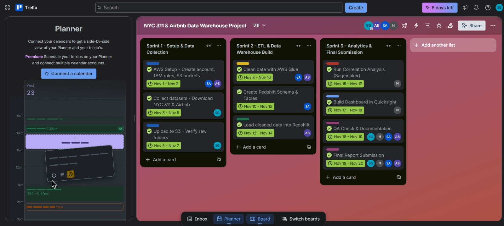

# Improving Urban Livability: NYC 311 & Airbnb Data Warehouse

**DATA 226 - Data Warehouse Project**
San Jose State University

## Team Members
- Shreya Akotiya
- Ashmita Paruchuri Balaji
- Nikitha Seelam Balaji
- Shashira Guntuka

---

## Overview

This project builds an end-to-end cloud-based data warehouse solution that integrates NYC 311 service requests with Airbnb listing data to analyze the relationship between short-term rental activity and urban livability. By combining these datasets, we uncover patterns showing how tourism and rental activity correlate with resident-reported issues such as noise complaints, sanitation problems, and illegal parking.

## Problem Statement

While NYC 311 complaint data and Airbnb listings are publicly available, there is limited joint analysis of these datasets. This project addresses the gap by building a comprehensive data warehouse that enables SQL queries and statistical analysis to identify trends—such as whether neighborhoods with higher Airbnb density experience more 311 complaints.

---

## Architecture


The pipeline follows an automated ETL workflow:
1. **Extract**: Data ingestion from NYC Open Data API and InsideAirbnb → MongoDB → Amazon S3
2. **Transform**: AWS Glue (311 data) and AWS Lambda + Step Functions (Airbnb data)
3. **Load**: Processed data loaded into Amazon Redshift star schema
4. **Analyze**: Amazon SageMaker notebooks for statistical analysis and ML
5. **Visualize**: Amazon QuickSight dashboards for interactive insights

---

## Technology Stack

| Component | Technology |
|-----------|------------|
| **Orchestration** | Apache Airflow, AWS Step Functions |
| **Storage** | Amazon S3, MongoDB Atlas |
| **ETL Processing** | AWS Glue (PySpark), AWS Lambda |
| **Data Warehouse** | Amazon Redshift |
| **Analysis** | Amazon SageMaker, Jupyter Notebooks |
| **Visualization** | Amazon QuickSight |
| **Languages** | Python, SQL |
| **Version Control** | Git, GitHub |

---

## Project Structure

```
├── src/
│   ├── 311/                          # NYC 311 data processing
│   │   ├── glue_job_clean_311.py    # AWS Glue ETL job for 311 data
│   │   ├── nyc_hybrid_etl_pipeline.py
│   │   ├── nyc_ingestion_dag.py     # Airflow DAG for 311 pipeline
│   │   └── Glue job to merge 311 Airbnb.py
│   ├── Airbnb/                       # Airbnb data processing
│   │   ├── airbnb_clean_data.py
│   │   ├── airbnb_read.py
│   │   └── lambda_transform_airbnb.py  # Lambda function for transformations
│   ├── Extract/                      # Data extraction scripts
│   │   ├── mongo_to_s3.py           # MongoDB to S3 data transfer
│   │   └── docker-compose.yml       # Docker setup for local Airflow
│   ├── Analysis/                     # Jupyter notebooks for analysis
│   │   ├── 311 Complaints Analysis (1).ipynb
│   │   ├── Airbnb Listings Analysis.ipynb
│   │   ├── Comined analysis.ipynb
│   │   └── DWProjectAnalaysis.ipynb
│   └── requirements.txt              # Python dependencies
├── sql/
│   └── redshift_311.sql             # Redshift schema DDL and data loading scripts
├── SageMaker/
│   └── DWProjectAnalaysis.ipynb     # SageMaker analysis notebook
├── DWProjectAnalaysis.ipynb         # Main analysis notebook
└── Data226_Project (1).pdf          # Project documentation
```

---

## Data Pipeline

### 311 Complaints Pipeline (AWS Glue)
- Extracts data from NYC Open Data API (SODA)
- Stages in MongoDB, then uploads to S3
- AWS Glue job cleans, transforms, and enriches data
- Loads into Redshift staging and dimension/fact tables

### Airbnb Pipeline (AWS Lambda + Step Functions)
- Reads CSV files from InsideAirbnb
- Step Function workflow orchestrates:
  - `UploadToS3`: Upload raw data
  - `CleanAirbnb`: Data cleaning and validation
  - `TransformToDimFact`: Convert to star schema format
- Loads transformed data into Redshift

### Orchestration
- Apache Airflow manages end-to-end workflow
- Automated scheduling with retry logic
- Monitoring and logging for pipeline reliability


---

## Data Warehouse Schema

**Star Schema Design** with shared dimensions for cross-domain analysis:

### Fact Tables
- `fact_311_complaint`: Service request records with duration, agency, location, complaint type
- `fact_airbnb_listings`: Listing details with price, reviews, availability, revenue estimates

### Dimension Tables
- `dim_date`: Shared temporal dimension (date, month, quarter, weekday)
- `dim_location`: Geohash, coordinates, borough, neighborhood
- `dim_311_agency`: Agency information
- `dim_311_complaint`: Complaint types
- `dim_311_borough`: Borough details
- `dim_airbnb_host`: Host information
- `dim_airbnb_property`: Room type, property type
- `dim_airbnb_location`: Spatial attributes for listings


---

## Key Features

### Data Processing
- **Geohash Generation**: Spatial matching between 311 complaints and Airbnb listings
- **Feature Engineering**: Duration calculations, temporal features, derived metrics
- **Data Cleaning**: Deduplication, coordinate validation, text standardization
- **Incremental Loading**: Only new/modified records loaded to minimize overhead
- **Parquet Optimization**: Columnar storage for efficient querying

### Analysis Capabilities
- Borough-level complaint distribution
- Top complaint types and resolution times
- Spatial correlation between Airbnb density and complaint volume
- Temporal trends and patterns
- Statistical correlation analysis

---

## Key Insights

1. **Correlation Found**: Higher Airbnb listing density correlates with increased 311 complaints, especially noise and quality-of-life issues

2. **Manhattan Hotspot**: Manhattan has the highest concentration of both Airbnb listings and complaints

3. **Fast Resolution**: ~75% of complaints resolved within 3 days

4. **Common Issues**: Illegal parking and residential noise are top complaint categories

5. **Spatial Overlap**: Geographic visualization confirms Airbnb hotspots align with complaint hotspots

6. **Borough Patterns**:
   - Brooklyn: Highest total complaints (~2M)
   - Manhattan: Highest Airbnb density and complaints per capita
   - Queens & Bronx: Moderate activity levels
   - Staten Island: Lowest activity in both metrics

---

## Optimization Techniques

- **Incremental Loading**: Only new/modified entries loaded to fact and dimension tables
- **Staging Pattern**: Data validated in staging tables before production load
- **Parquet Format**: Columnar storage for faster I/O and reduced costs
- **Set-Based SQL**: Bulk operations instead of row-by-row processing
- **Distribution Keys**: DISTKEY and SORTKEY optimization in Redshift
- **Shared Dimensions**: Prevent duplication with reusable dimension tables
- **Serverless Architecture**: Lambda and Step Functions for cost efficiency
- **Pre-Load Cleaning**: Data standardization before Redshift ingestion

---

## Dataset Sources

- **NYC 311 Service Requests**: [NYC Open Data Portal](https://data.cityofnewyork.us/)
- **Airbnb Listings**: [Inside Airbnb](http://insideairbnb.com/get-the-data.html)

---

## Agile/ Scrum workflow
- [Trello Kanban board](https://trello.com/b/sLe3mkUC/nyc-311-airbnb-data-warehouse-project)
- 
  
---
## References

1. NYC Open Data - [311 Service Requests](https://data.cityofnewyork.us/)
2. Inside Airbnb - [Get the Data](http://insideairbnb.com/get-the-data.html)
3. AWS Documentation:
   - [AWS Glue](https://docs.aws.amazon.com/glue/)
   - [Amazon Redshift](https://docs.aws.amazon.com/redshift/)
   - [Amazon QuickSight](https://docs.aws.amazon.com/quicksight/)
4. [Apache Airflow Documentation](https://airflow.apache.org/docs/)

---

## License

This project is for educational purposes as part of DATA 226 coursework at San Jose State University.


